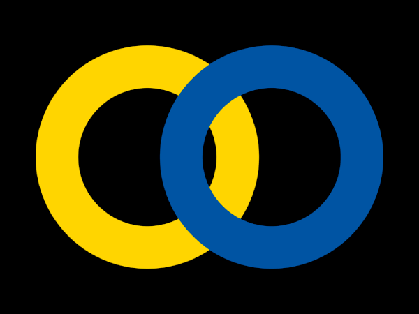

# Rings


Source: Sonia Delaunay inspired ring animation but Aleš Brce [https://www.behance.net/gallery/44377671/SONIA-DELAUNAY-130](https://www.behance.net/gallery/44377671/SONIA-DELAUNAY-130)

# The code

```javascript
var canvasWidth = 400;
var canvasHeight = 400;
var blueX = canvasWidth / 2;
var yellowX = canvasWidth / 2;
var dx = 2;
var yellowDx = -2;
var blueColor, yellowColor;

function setup() {
  createCanvas(canvasWidth, canvasHeight);
  blueColor = color(25, 181, 254);
  yellowColor = color(254, 241, 96);
}

function updatePosition() {
  if (blueX + dx > canvasHeight - 130) {
    dx = -dx;
    blueColor = color(254, 241, 96);
    yellowColor = color(25, 181, 254);
  } else if (blueX + dx < 130) {
    dx = -dx;
    blueColor = color(25, 181, 254);
    yellowColor = color(254, 241, 96);
  }
  yellowX -= dx;
  blueX += dx;
}

function draw() {
  background(0);
  updatePosition();
  strokeWeight(30);
  noFill();
  drawBlueSquare();
  drawYellowSquare();
}

function drawBlueSquare() {
  push();
  stroke(blueColor);
  ellipse(blueX, canvasHeight / 2, 180, 180);
  pop();
}

function drawYellowSquare() {
  push();
  stroke(yellowColor);
  ellipse(yellowX, canvasHeight / 2, 180, 180);
  pop();
}
```

## My attempt


potential improvements would be to get the rings to change their order so the rings pass infront of each other
